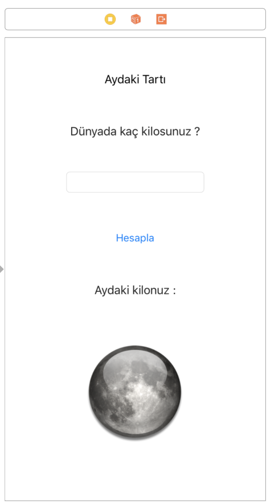
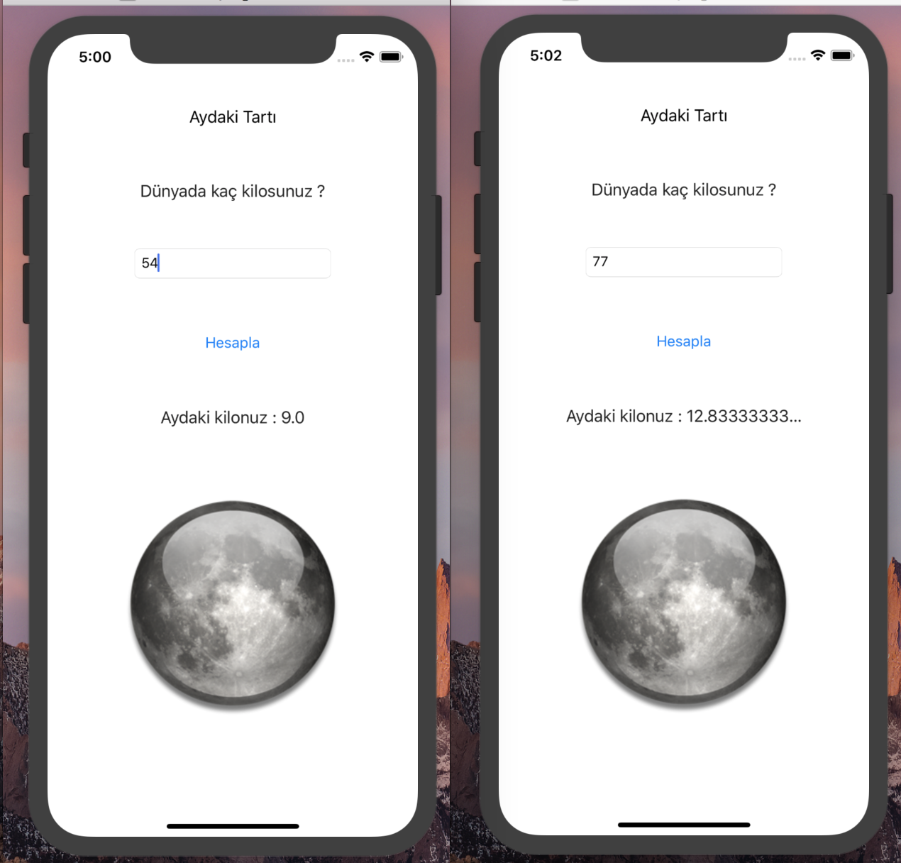

# Moon 🌙 Weight 🏋🏻‍♂️ App 💻


Our Mass in the Moon is an iOS application developed with Swift-5.5. It is an application that learns how many kilos the user weighs and calculates how many kilos we would have had if we were on the Moon. To find our mass on the Moon, we find the normal mass by dividing by 6. 

## App Design 👨🏻‍💻

 

The application uses many different components such as image, button, textfield and label. The user will be able to find his mass on the Moon by entering his mass in the required field and then pressing the calculate button.

## App Demo 🎬

 

The user can enter his weight and see the monthly equivalent. The user only has a mass that is directly divisible by 6
Since it would be absurd to think that it has, we defined the values as double and performed the operations.

## Detailed Description of the Application 👀

I wrote a blog post about the app. You can access the article from the link below:

[Swift-4 ile iOS Uygulaması - Aydaki Ağırlığımız Ne Kadar ?](https://medium.com/@halilozel1903/swift-4-ile-ios-uygulamas%C4%B1-aydaki-k%C3%BCtlemiz-ne-kadar-73084561f838)


## Explanation of Application Codes 🔎

```swift 
 @IBOutlet weak var kutleText: UITextField!
 @IBOutlet weak var sonucText: UILabel!
```
We defined a Text Field to get the mass value. We defined a label to process the received value and display it to the user.


```swift 
 @IBAction func calculate(_ sender: Any) {
        
        var kutle = Double(kutleText.text!)
        var sonuc = kutle! / 6.0
        
        sonucText.text = "Aydaki kilonuz : \(sonuc)"
        
    }
```

We want an action to be taken when the button is pressed. The value received from the user is divided by 6 and assigned to a variable. We show this value to the user on the screen. We assigned this value to the result label.

## License ℹ️
```
MIT License

Copyright (c) 2022 Halil OZEL

Permission is hereby granted, free of charge, to any person obtaining a copy
of this software and associated documentation files (the "Software"), to deal
in the Software without restriction, including without limitation the rights
to use, copy, modify, merge, publish, distribute, sublicense, and/or sell
copies of the Software, and to permit persons to whom the Software is
furnished to do so, subject to the following conditions:

The above copyright notice and this permission notice shall be included in all
copies or substantial portions of the Software.

THE SOFTWARE IS PROVIDED "AS IS", WITHOUT WARRANTY OF ANY KIND, EXPRESS OR
IMPLIED, INCLUDING BUT NOT LIMITED TO THE WARRANTIES OF MERCHANTABILITY,
FITNESS FOR A PARTICULAR PURPOSE AND NONINFRINGEMENT. IN NO EVENT SHALL THE
AUTHORS OR COPYRIGHT HOLDERS BE LIABLE FOR ANY CLAIM, DAMAGES OR OTHER
LIABILITY, WHETHER IN AN ACTION OF CONTRACT, TORT OR OTHERWISE, ARISING FROM,
OUT OF OR IN CONNECTION WITH THE SOFTWARE OR THE USE OR OTHER DEALINGS IN THE
SOFTWARE.
```


